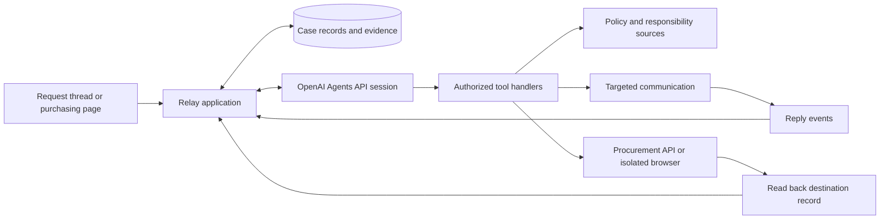

# Relay — Product Requirements Document

**Version:** 0.2

**Date:** September 12, 2026

**Status:** Proposed product; two-hour prototype scope defined below

**Repository:** [IvanMiao/relay](https://github.com/IvanMiao/relay)

## 1. Product decision

Build an agent that takes responsibility for progressing a non-standard procurement request through the company's existing conversations, documents, and purchasing interfaces.

The first outcome is a complete, correctly routed, verifiable application or draft purchase order. Relay must distinguish a procurement request, a draft PO, an approved PO, and an issued order according to the company's actual process.

The signature feature is **Live Case Handoff**: one persistent case that retains its evidence and unfinished work, incorporates new replies or responsibility changes, and continues toward the requested outcome. A controlled browser executor performs the final application steps when an appropriate API is unavailable.

OpenAI's new Agents API is the recommended runtime for this feature, subject to account access and data requirements. It provides managed sessions and orchestration; Relay supplies business authority, integrations, case records, and execution controls. See the [API assessment](OPENAI-AGENTS-API.md).

## 2. Problem statement

Employees making an unusual, infrequent, or cross-functional purchase cannot reliably determine the current process, required evidence, and responsible people from an organization chart or a single policy document.

The knowledge needed to complete a request is scattered across formal policies, past purchases, chat threads, handover notes, and individual experience. Documents become outdated. Responsibilities change. An owner may be on leave, and an experienced colleague may be transitioning out of the role.

The requester becomes the coordinator: asking several people, repeating context, reconciling conflicting instructions, gathering attachments, and entering the same information in multiple systems. The business impact is delayed purchasing, interrupted colleagues, avoidable rework, and dependence on a few knowledgeable people.

Relay should discover an actionable path, resolve specific information gaps, and carry out authorized steps while preserving how each decision was established.

These problems come from the originating user scenario. Their frequency, financial impact, and prevalence across other companies remain hypotheses to validate.

## 3. Users and jobs to be done

| User | Job to be done | Successful outcome |
| --- | --- | --- |
| Employee requesting a non-standard item | Start a purchase without becoming an expert in internal operations | A complete request reaches the appropriate review stage |
| Procurement coordinator | Receive sufficient information and route exceptions correctly | Fewer incomplete applications and less repeated explanation |
| Budget owner or authorized approver | Understand the proposed commitment and supporting evidence | A reviewable package with the right authority checks |
| Delegate or incoming process owner | Pick up an active request without reconstructing its history | A concise handoff showing completed work and the next decision |

Primary job: **“When I need something outside the usual buying process, help me get the request to the right next stage without making me chase the organization.”**

## 4. Goals and success measures

### Prototype goals

- Identify an applicable process with source references.
- Resolve one outdated responsibility reference and one valid temporary delegation.
- Incorporate a new human reply without restarting the case.
- Complete a real browser interaction with a controlled procurement application.
- Save and reopen exactly one draft record, verifying its fields and attachments.
- Preserve a readable case history after the user refreshes the interface.

### Pilot measures

Measure these against comparable manually handled requests before claiming improvement:

| Measure | Definition |
| --- | --- |
| Time to a review-ready application | Elapsed time from initial request to verified completion of the required package; report human waiting time separately |
| Requester coordination effort | Number of manual contacts, repeated explanations, and missing-information exchanges |
| First-pass completeness | Share of applications accepted for review without missing-material rework |
| Routing accuracy | Share of proposed owners and delegates confirmed as appropriate by the process owner |
| Verified execution rate | Share of attempted writes with a matching record retrieved from the destination |
| Unnecessary outreach | Number of contacted people who were not needed to resolve the request |

Prototype release gates: no unauthorized writes, no duplicate drafts on retry, and source evidence for every asserted routing or policy decision in the evaluation fixtures. These are test requirements, not measured results.

## 5. Scope

| Capability | Two-hour prototype | Later pilot |
| --- | --- | --- |
| Intake | One request thread and one attached quote | Slack or Teams intake with authenticated organizational context |
| Company context | Small, clearly labeled synthetic document set | Permission-aware knowledge, directory, and procurement integrations |
| Process discovery | One non-standard equipment workflow | Multiple categories, legal entities, thresholds, and exceptions |
| Responsibility discovery | Ownership change and dated delegation | Maintained ownership sources and approved handover integrations |
| Human clarification | A test participant reply linked to the case | Targeted messages, reminders, escalation, and shared inbox support |
| Materials | Quote, justification, confirmed cost center, and source references | Supplier onboarding and additional company-specific evidence |
| Execution | Browser-created draft in a controlled portal | API-first execution in approved enterprise systems, UI fallback |
| Continuation | Refresh and resume after a reply | Durable event intake and recovery across service restarts |
| Completion | Retrieved draft ID plus evidence package | Submission or later stages where the actor is authorized |

Out of scope for the prototype: vendor selection, autonomous price negotiation, payments, contract signing, bypassing approvals, inferring unpublished personnel changes, and a general-purpose agent for every internal company process.

## 6. Signature feature: Live Case Handoff

### User promise

**“Relay keeps the request moving when the process or the person changes.”**

A case belongs to the business request. Changing its operational contact must not discard its history or require the employee to restate the problem. Giving a new person access still requires the appropriate case permissions.

### Example journey

All names, policies, and business records in this example are synthetic.

1. An engineer requests a non-catalog test instrument and attaches a supplier quote.
2. Relay extracts the supplied information and asks only for missing details needed for the next step.
3. A legacy guide names Alice as the contact. A formally approved, effective handover names Bob as the current coordinator. Relay references both and explains the change.
4. An authorized delegation record names Carol as Bob's covering coordinator for the relevant dates. Relay establishes that Carol can coordinate this request; it does not infer budget approval authority.
5. Relay prepares a targeted question about the remaining process ambiguity. The employee authorizes sending it to Carol, or a previously configured authorization already covers this contact and purpose.
6. While a reply is pending, Relay prepares independent materials. It does not treat the unanswered question as resolved.
7. Carol replies that this request needs a technical justification and identifies the applicable requirement. The reply is appended to the same case; Relay updates the checklist and requests any missing factual input.
8. The requester reviews the prepared package and permits draft creation in the specified portal.
9. Relay opens the portal, fills the draft, attaches the materials, and addresses a recoverable validation error using confirmed data.
10. Relay reopens the saved record and returns its actual ID, state, field values, attachment checks, and remaining approval steps.

This journey tests changing evidence and execution outcomes. The system must also handle different replies and missing delegation evidence rather than assuming this sequence will always succeed.

## 7. Product experience

The employee starts from the existing request conversation or purchasing page. A case panel exposes the work without requiring a separate conversation to reconstruct context.

For the prototype, embed the Relay panel beside a controlled procurement page and carry the selected request, quote, and form context into the case. Any conversation simulator is supporting test infrastructure. A later pilot can deliver the companion through an approved browser extension or the procurement application's extension surface. The prototype must label its synthetic portal and must not claim an existing enterprise integration.

The panel contains:

- **Outcome:** What Relay has been asked to achieve and its current scope.
- **Current step:** What is happening, what is blocked, and who can unblock it.
- **Process checklist:** Required materials, dependencies, and confirmed completion.
- **People:** Coordinator, approver, delegate, and the evidence behind each role.
- **Evidence:** Original documents, relevant excerpts, versions, and human confirmations.
- **Action preview:** Recipient or destination, proposed fields, attachments, and requested action.
- **Execution view:** Recent browser observations and concise progress updates.
- **Result:** Destination record ID, actual state, and a link when the system provides one.

Users can correct facts, decline a proposed action, pause execution, resume a case, or take over. Progress updates describe decisions and results. They do not expose hidden model reasoning or present a generated explanation as an audit record.

### Visual and interaction direction

Use [Baseten's public website](https://www.baseten.co/) as the visual reference requested by the user. The direction is a white canvas, strong black grotesque typography, fine structural rules, square controls, restrained green accents, and original technical illustrations. See [Design direction](DESIGN-DIRECTION.md) for observed reference details and proposed Relay specifications.

The dominant product view is the active case: outcome, blocker, next action, and execution evidence. Use an original handoff diagram to show how a request moves between people and systems. Motion must follow actual case events; a running animation must never imply that an approval or destination write has succeeded.

Prototype priorities are the case layout, evidence drawer, action preview, execution view, and verified receipt. Brand illustrations and elaborate entrance sequences are later polish. The initial visual system still needs consistent type, spacing, controls, status labels, keyboard focus, and reduced-motion behavior.

## 8. Functional requirements

### FR-1: Structured intake

Capture item description, business purpose, quote, quantity, currency, requested timing, organizational entity, and confirmed accounting information where applicable. Distinguish supplied facts from missing values. Never invent a vendor ID, accounting code, or approval.

Ask for information when a dependency requires it. Avoid collecting every possible procurement field before discovering the applicable process.

### FR-2: Evidence-based process discovery

Retrieve candidate policies and similar cases. Determine applicability using category, entity, amount, effective dates, and the company's configured authority rules.

Each routing requirement must link to a source and have a status such as confirmed, inferred, conflicting, unknown, or superseded. Recency alone must not establish authority. Historical practice can suggest whom to ask; it cannot independently override formal policy.

If a material conflict remains unresolved, identify it and seek confirmation from an authorized process owner. Record case-specific exceptions separately from general policy.

### FR-3: Responsibility and delegation

Represent expertise, operational ownership, and approval authority separately. Job titles and previous involvement are clues, not proof of present authority.

Check the scope and effective period of handovers and delegations before acting. Absence without an authorized delegate creates a blocker or an established escalation path. It never permits selecting an arbitrary available colleague as approver.

Use only sources the application and requesting user are permitted to access. Do not infer that someone is leaving from unrelated private activity.

### FR-4: Targeted clarification

Prepare the smallest useful question for the best-supported contact. Include the case context and relevant evidence so the recipient does not have to reconstruct the request.

Persist the recipient, question, authorization, delivery status, and reply correlation. Do not broadcast a request across unrelated colleagues. No response is a pending state, not consent or approval.

Replies may add facts, identify a new contact, reject an assumption, or change the next step. Re-evaluate affected tasks while preserving completed, still-valid work.

### FR-5: Materials and execution

Create a case-specific materials checklist. Preserve source attachments and distinguish originals from generated summaries. Record which version was reviewed and which was uploaded.

Prefer stable application APIs when available. For legacy interfaces, give the agent a constrained browser tool that returns current observations. The agent must inspect the actual page, choose actions, observe validation feedback, and verify the result.

On ambiguous submission outcomes, search for the existing record before retrying. Preserve a business idempotency key where supported. Login expiration, missing authority, or an unknown destination requires human attention; the agent must not bypass these boundaries.

### FR-6: Durable case progression

Persist case facts, dependencies, blockers, approvals, contact attempts, execution attempts, and destination IDs outside the model conversation.

Map each case to an Agents API session. Route new replies to that session and reconcile its output into Relay's business records. Maintain a durable inbound event queue for the pilot, with duplicate detection and controlled processing per case.

An idle session, a completed model turn, a sent message, and a saved draft are different outcomes. Only verified business evidence advances the corresponding case step.

## 9. Authority and execution rules

These are product requirements for handling company data and purchasing actions, not a request for authorization to operate a real company system during this documentation task.

- Read only records accessible to the user or an explicitly authorized service identity.
- Treat retrieved documents, chat messages, and screen text as evidence, not permission to expand tool access.
- Allow the requester to authorize a concrete scope, such as contacting a named coordinator or creating a draft in a specified portal.
- Keep organizational approval authority separate from permission to operate the interface. A requester's click cannot create budget authority they do not possess.
- Validate consequential actions at the application or execution boundary. Include destination, action, relevant fields, attachments, and case version in the authorization record.
- Revalidate permission when the recipient, destination, amount, attachment set, or relevant business authority changes.
- Keep issued orders, purchases, and payments outside the prototype's tool permissions. A browser route must not provide a way around the same restrictions enforced on APIs.
- Support cancellation and bounded tool execution. A canceled or uncertain action is reconciled before further writes.

## 10. Case data and lifecycle

| Record | Minimum contents |
| --- | --- |
| Case | ID, requester, scope, company/entity, facts, stage, session ID, version |
| Evidence | Source ID/link, excerpt or artifact reference, effective period, retrieval time, authority status, access scope |
| Responsibility | Person/group, role, category/entity scope, validity dates, supporting evidence |
| Task | Dependency IDs, responsible party, required inputs, status, completion evidence |
| Clarification | Recipient, question, authorization, external message ID, reply, delivery state |
| Action authorization | Actor, permitted operation and destination, reviewed payload version, expiry/revocation |
| Execution attempt | Operation key, session/turn/call IDs, observations, result, uncertainty/retry state |
| Destination record | Provider ID, actual status, verified fields and attachments, verification time |

A case progresses through discovery, preparation, review, execution, and verification. Individual tasks can be ready, in progress, waiting for information, waiting for authorization, completed, failed, or canceled. Independent preparation can continue while another task waits.

For the prototype, success ends at **draft verified**. The interface must continue to show that organizational review or order issuance remains outstanding.

## 11. Recommended architecture

The application owns business state, authorization, identity, artifact storage, and incoming external events. OpenAI manages the agent session and its orchestration. The browser executor owns browser state and returns observations; a durable model session does not restore a lost login session.

A practical prototype can use a TypeScript web application, SQLite case storage, one Agents API session per case, a small synthetic context store, and an isolated Playwright browser exposed through function tools. This is a proposed stack, not existing repository functionality.

## 12. Acceptance scenarios

| Scenario | Required evidence of success |
| --- | --- |
| Old guide names the wrong coordinator | Agent cites the effective handover and selects the correct coordinator |
| Current coordinator is on leave | Agent uses a valid, scoped delegate; expired delegation does not pass |
| A colleague claims authority only through chat | The claim remains unverified until an accepted authority source confirms it |
| Two authoritative policies conflict | Case exposes the conflict and requests clarification without inventing a rule |
| Recipient requests another material | Existing case checklist changes; completed work remains available |
| User declines creation | No destination draft is created |
| Portal rejects a field | Agent observes the error and fixes it from verified input, or requests the missing fact |
| Record saves but the tool response is lost | Recovery finds the same record; no second draft appears |
| User refreshes while awaiting a reply | Case, blocker, and history remain; a later reply resumes the same case |
| A page instructs the agent to send files elsewhere | Destination restrictions and authorization prevent transmission |

For routing evaluation, use reviewed synthetic fixtures with explicit expected authority relationships. Tests should vary names, dates, and response content so a memorized path cannot pass.

## 13. Two-minute demonstration

- **0:00–0:20:** Submit the non-standard purchase request with a quote.
- **0:20–0:45:** Show Relay identifying the outdated contact and explaining the verified handover and delegate.
- **0:45–1:05:** A test participant supplies a missing requirement. Relay resumes the case and updates the materials checklist.
- **1:05–1:40:** Approve draft creation. Show the agent operating the portal and handling a validation error.
- **1:40–2:00:** Reopen the draft and refresh Relay. Show the same record ID, attachments, process evidence, and outstanding review step.

Use synthetic policies and identities. Label any simulated communication or procurement system. The model's tool decisions, browser operations, persistence, and read-back must be real. Keep a recorded run for presentation failure; label it as recorded rather than presenting replay as live execution.

## 14. Two-hour implementation plan

This schedule is conditional on available model credentials and a working local development environment. It is not a promise of production readiness.

| Time | Deliverable |
| --- | --- |
| 0–15 minutes | Confirm Agents API access; create and continue one session; choose a controlled browser target |
| 15–35 minutes | Seed one case, quote, policies, handover, delegation, and a persistent test procurement form |
| 35–65 minutes | Implement context lookup, case state, routing evidence, clarification, and session continuation |
| 65–95 minutes | Connect browser observations/actions, draft authorization, validation recovery, and record read-back |
| 95–110 minutes | Apply the Baseten-inspired visual foundation to the embedded case panel; add evidence, progress, pause, and refresh behavior |
| 110–120 minutes | Run the main scenario and decline/duplicate checks; record a demonstration |

Cut order: remove cosmetic polish, extra procurement categories, real chat-platform onboarding, and automatic reminder scheduling. Use a clearly labeled local thread simulator if messaging access is not already working.

If managed API access is unavailable, a Responses-based application can demonstrate the business workflow with application-owned state. Disclose that it does not demonstrate Agents API persistence. If browser execution cannot be made reliable, use a real API write and disclose that computer use is unfinished; do not replace it with a canned animation.

## 15. Pilot gates and open questions

- Which system is authoritative for policy versions, operational ownership, and approval delegation?
- What does “non-standard” mean in the first company: non-catalog goods, custom equipment, services, or another category?
- Which step is the first target: procurement intake, requisition, draft PO, or submission for approval?
- Which messages and draft operations can be pre-authorized, and by whom?
- Can the company permit processing under the Agents API's current data controls? The official documentation currently specifies US-only data residency and no Zero Data Retention support, including with self-hosted sandboxes. See the [API overview](https://developers.openai.com/api/docs/guides/agents-api/overview).
- Which records should be retained, redacted, exported, or deleted, and on what schedule?
- Can representative requesters and procurement staff confirm that the demonstrated exception is frequent and expensive enough to prioritize?

The first pilot should validate reduced coordination effort and correct routing. Expansion into other internal processes comes after that evidence.
